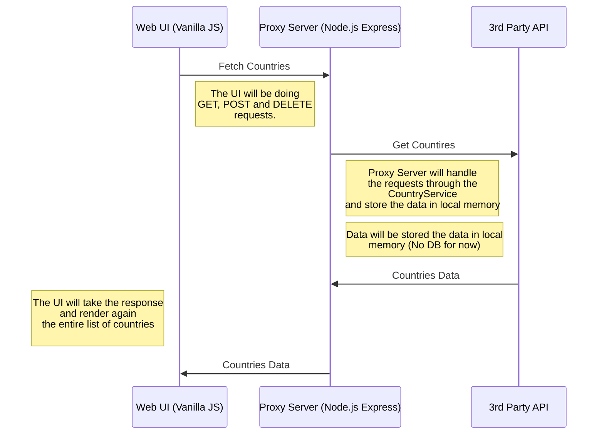

# Full Stack JavaScript Web and API

## Web App (Vanilla JS, CSS Grid) and Proxy Server (Node.js, Express.js, Typescript )

**Target audience of this document:** Tech hiring managers and developers that want to learn and understand web development and the use of good coding practices in the most simple way possible.

**Problem we are solving:**

A user wants to know about a location having a country code and a zip code as initial information. For example: Country: US ZipCode: 10001 

Resources available:
A 3rd party API service; for this specific case scenario we will use the public API  [http://www.zippopotam.us](http://www.zippopotam.us)

Scope for the Web App:
- UI displays a form with a search area.
	- User is able to enter a country code and a zip code of that country.
	- User is able to visualize the location information response for their request to the 3rd party service based on the country code and zipcode.
	- User is able to visualize a history of their search.
	- User is able to clear the data.

Scope for the REST API:
- Takes a country code and a zip code.
- Communicates with Zippopotam API
- Responds with the information according to the given country code and zip code.

**Principles applied to build the solution:**
- Prioritize clarity, reusability and readability when reading the code.
- Use of Airbnb's javascript style guide.
- Use of SOLID principles when applicable.
- Use a functional programming approach.
- Use of DRY - Don't Repeat Yourself principles.

**Disclaimer. All of this project is still work in progress; the latest version in the repo should always be working.**

**What you can expect:**

- Use of new javascript features ES6 and up.
- Modularity and reusable functions and classes in both UI and API side.
- Responsive and intuitive UI compatible with Safari and Chrome.
- Use of vanilla CSS and a CSS GRID layout.
- Use of reusable global functions for DRY purposes.
- Centralized error handling for the API for the most common scenarios.
- The use of immutable data structures to help prevent bugs caused by unexpected state changes.
- Separation of concerns.
- Code that is easy to follow and test.
- Simplicity.

**Do not expect right now (Future improvements):**
- Validations of any kind for the inputs.
- No optimization for large inputs or high-frequency updates.
- Centralized state management for the UI using a JS Object.
- Use of OO paradigm for the UI.
- Unit testing and E2E testing neither for the UI or API.
- Encrypted requests through HTTPS.
- Sanitized UI inputs to improve the security of the API.
-  Use of typescript for the UI.
- Compatibility with other browsers that are not the latest Chrome and Safari.
- Managing all posible failure scenarios of the 3rd party service.
- High Security standards for both UI and API.
- Error management for the UI is not in place yet.
- Mobile UI optimizations for devices with a lower resolution than a tablet.
- Use of an external UI component library.
- No CI/CD, this is a project that runs locally.
- No Database, at the moment everything is stored as JS objects in memory.
- A polished experience with a color palette, symmetry and visual balance across the UI elements.

## Overview of the Application; UI and API
There are three components of the application:
- Web UI running from a Python server at: http://localhost:8000/web/
- Proxy Server. Node & Express API running at: http://localhost:3000/v1/countries
- 3rd Party API http://zippopotam.us



## Web UI 

After running NPM Install execute the command from your terminal:

>npm run start-web

This command will start python web server and you will be able to load the web server from this path from your browser:

>http://localhost:8000/web/

## Files and Folders

Directory of the Web UI:
>./web
>index.html
>script.js
>countries.js

## Thought process/strategy for implementing the UI.

The UI was done with vanilla JS, given the size of the problem and user requirements the use of React, Angular or other tools would be too much for solving the problem, later React will be added to demonstrate its use and good practices.

For selecting a country there is a static list of countries taken from the 3rd Party API docs.

The approach was to create pure functions using async/await to make the code readable and easy to follow. Functions were separated to accomplish a single task. 

Functions can be separated into two categories, the functions to communicate with the Proxy server for fetching data, saving data, deleting data and the functions to update the UI with the information coming from the Proxy server or deleted from the user.

There is a global function that is used to add event listeners to the DOM elements as a way to manage the event listeners and their callbacks from one single place, also this would help unit testing in the future.

Every time we get, save or delete to the Proxy Server the render function is called again to update the UI.


## Proxy Server API

The API is a Node.js and Express Application. After running NPM Install execute the command from your terminal:

>npm run start

This command will start node.js  server and you will be able to load the web api from this path from your browser:

>http://localhost:3000/v1/countries

### Files and Folders

Directory of the Web API:

> ./src  
> app.ts  
> countryRoutes.ts  
> countryService.ts
> errorHandler.ts
> messageModel.ts
> ZipoppotamAdapter.ts

## Thought process/strategy for implementing the API.

The API was developed using Typescript prioritizing types over interfaces. 

### Routing

Routing was implemented with Express Router to be modular, testable and easy to maintain as the application grows, separating the HTTP layer and the service layer; it handles the specifics of HTTP like status codes and parsing requests parameters.

The Country router uses the Country service, the entire router setup is an encapsulated function, making it easy to create multiple routers with different services as needed. 

The REST API will be accessible through four routes:

- Route to get the location data from the 3rd Party API.
```
curl -X GET http://localhost:3000/v1/countries\
-H "Content-Type: application/json" \
```
- Route to get saved countries list
```
curl -X POST http://localhost:3000/v1/countries \
-H "Content-Type: application/json" \
-d '{"country": "us", "zip": "78744"}'
```
- Route to add a new country to the list
```
curl -X POST http://localhost:3000/v1/countries \
-H "Content-Type: application/json" \
-d '{"country": "us", "zip": "78744"}'
```
- Route to delete a country from the list.
```
curl -X DELETE http://localhost:3000/v1/countries/2 \
-H "Content-Type: application/json" \
```

The router focuses on happy paths while error handling is centralized.

#### Error handling.

There is a middleware to handle errors, this will allow to have consistent error responses across the application and can be extended for other type of errors.

### The CountryService.

The core logic was delegated to the CountryService using a functional approach to build a foundation for a maintainable and scalable service. 

The state of the application is encapsulated within the countries object being used as closure through the rest of the CountryService function.

There is a ZippopotamAdapter being injected into the service making the service more flexible and easier to test.


### Design patterns - Adapter Pattern
The adapter pattern was applied to communicate with the 3rd party API. 

Read more about the Adapter Pattern here: https://refactoring.guru/design-patterns/adapter

**Please share feedback and comments to bsorianodev@gmail.com**

